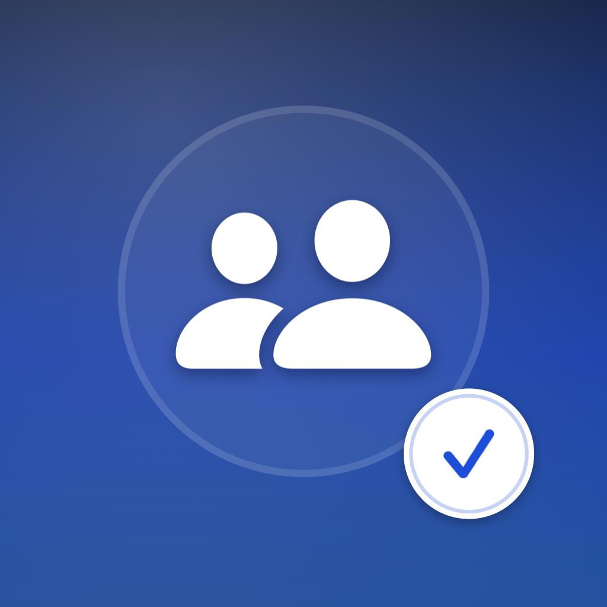
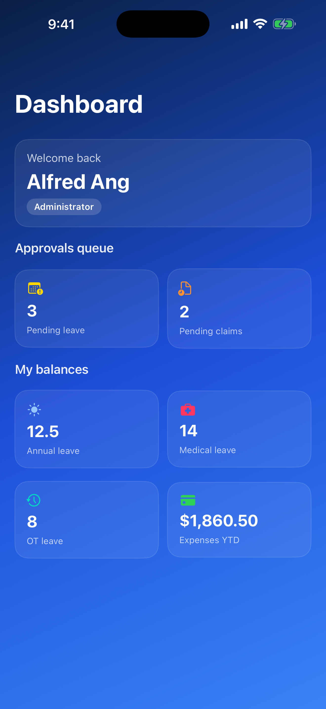
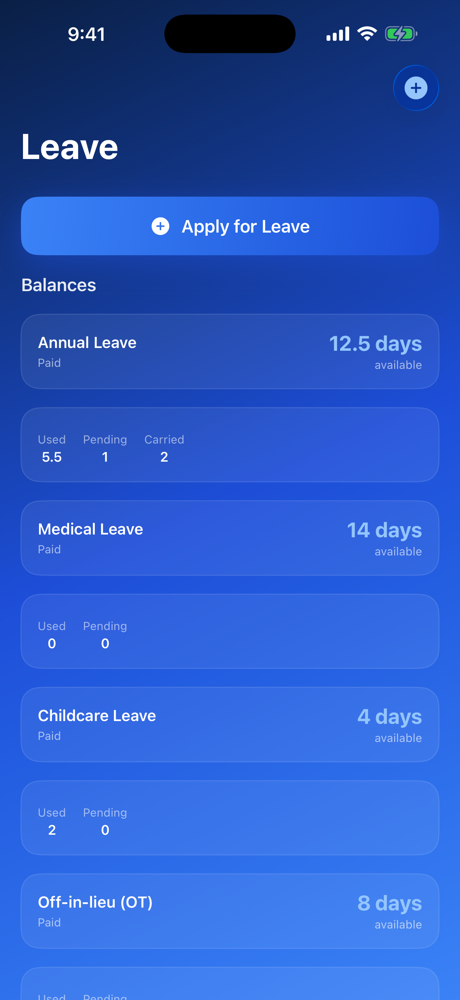
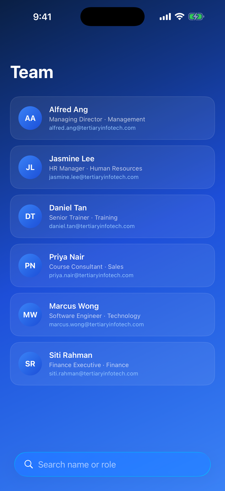
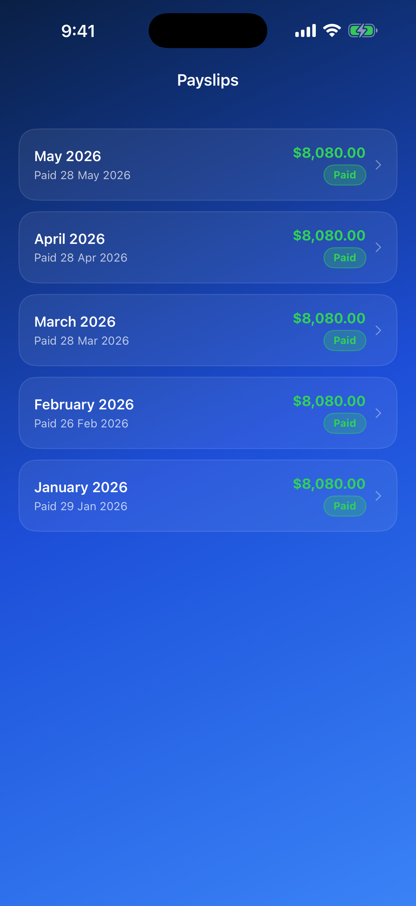
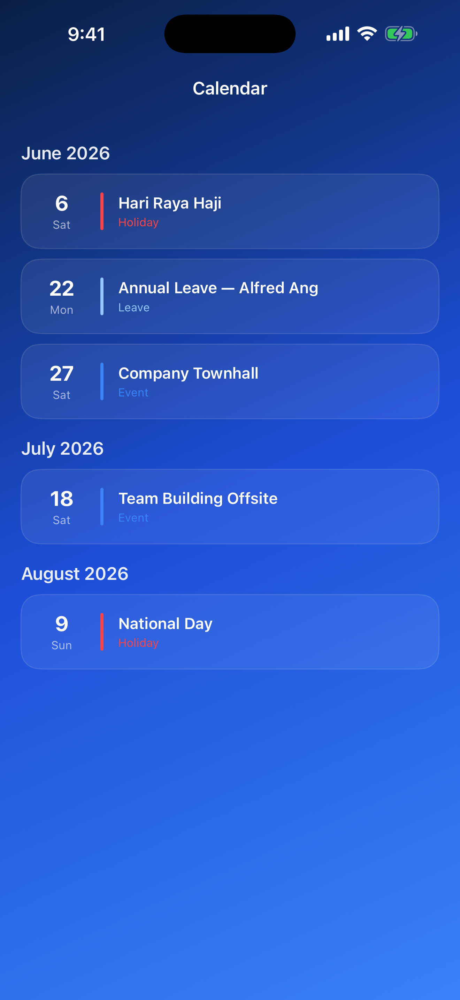
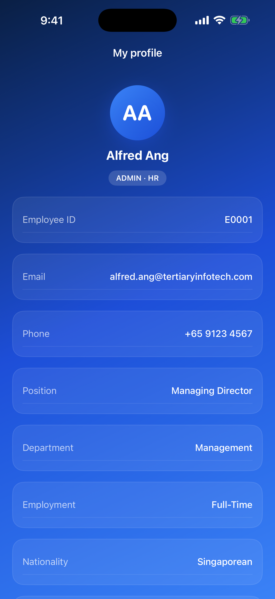
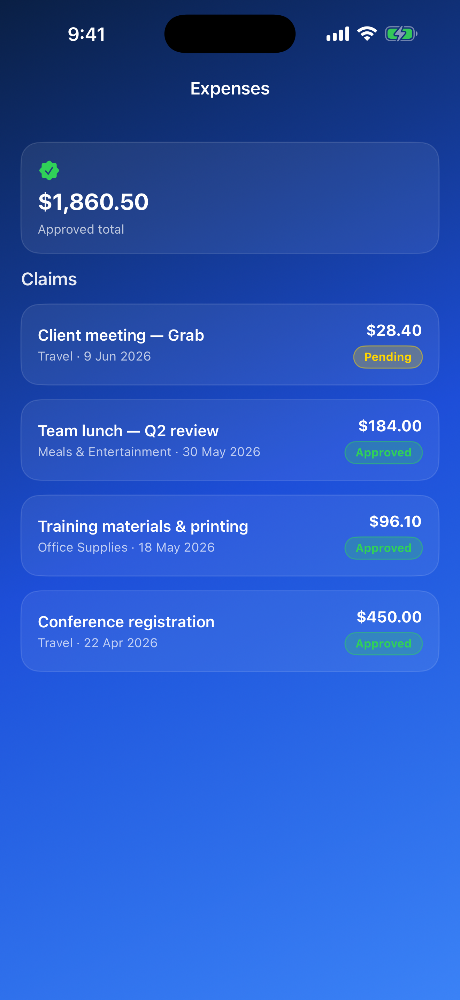
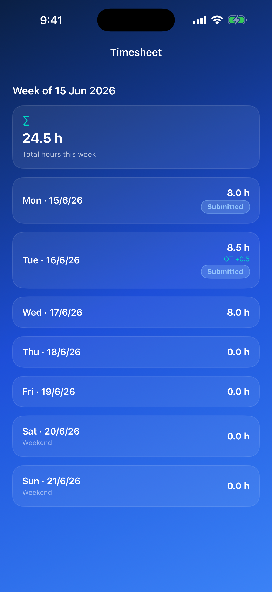

<div align="center">



# Tertiary HRMS — iOS

**Native SwiftUI client for the Tertiary Infotech Academy HR Management System.**

A fully native iPhone app (no Capacitor, no WebView) that signs employees in and pulls their HR
data live from the company's HRMS backend on Coolify.


-0A1F44?logo=appstore)


</div>

## Screenshots


| Dashboard | Leave | Team | Payslips |
|---|---|---|---|
|  |  |  |  |

| Calendar | Profile | Expenses | Timesheet |
|---|---|---|---|
|  |  |  |  |

## What it is

This is the App Store build of the Tertiary HRMS, rebuilt **natively in SwiftUI**. It is a thin,
secure client over the existing HRMS web backend — it holds no database of its own and enforces no
business rules locally; the server remains the single source of truth.

- **Backend:** the HRMS **Next.js 14** app deployed on **Coolify** at
  `https://hrms.tertiaryinfotech.com`, backed by PostgreSQL on the same Coolify host.
- **The iOS app pulls all data from that Coolify deployment over HTTPS** through the web app's
  authenticated API — it never touches the database directly.
- **Auth** reuses the web app's **NextAuth (Auth.js)** session: a standard
  `csrf → callback → session` flow, with the session cookie persisted so employees stay signed in.
  Both **email + password** and **email one-time-code (OTP)** are supported.
- A small, **additive, read-only `/api/mobile/*`** namespace was added to the web backend to expose
  (as JSON) the same data the web pages render. It changes no existing web behaviour.

## Features

**Included** — the employee HR experience:

| Module | What you get |
|---|---|
| 🔐 **Login** | Premier-Blue email + password and email-OTP sign-in; session persists across launches |
| 🏠 **Dashboard** | Annual / medical / OT leave balances, expenses YTD, and (for ADMIN/HR/MANAGER) the pending-approvals queue |
| 🗓️ **Leave** | Balances, full request history, and **apply for leave** (server computes working days & proration) |
| 👥 **Team** | Company directory (richer contact details for supervisory roles) |
| 🧾 **Payslips** | Personal payslips with a native **PDFKit** viewer for the authenticated PDF |
| 💳 **Expenses** | Personal expense claims with status and approved totals |
| 📅 **Calendar** | Public holidays, your events, and your approved leave, grouped by month |
| ⏱️ **Timesheet** | The current week's hours and OT |
| 🙋 **Profile** | Your full employee record |

**Excluded** — by product decision:

- The **Accounting module** in full (bank-statement import, dedupe, reconciliation, income/expense
  tracking) — back-office finance, not part of the mobile employee experience.
- Heavy **admin authoring** flows (creating employees, generating payroll, company settings, email
  templates) — these remain on the web; the dashboard surfaces approval counts only.

## Tech

- **Swift 5 / SwiftUI**, MVVM, single coordinator (`AuthViewModel`).
- Networking: two `actor`s — `AuthService` (NextAuth sign-in) and `HRMSAPI` (typed reads +
  apply-leave + PDF download) over a shared cookie store.
- **System frameworks only** — SwiftUI, Foundation/URLSession, PDFKit. No third-party dependencies.
- **XcodeGen** project generation (`project.yml`); the `.xcodeproj` is gitignored.
- iOS 16+, iPhone, portrait. Theme: **Premier Blue** (navy → premier-blue → azure).

## Build

```bash
brew install xcodegen        # one-time
xcodegen generate

# Compile-check in the Simulator (no signing required)
xcodebuild build -project TertiaryHRMSiOSApp.xcodeproj -scheme TertiaryHRMSiOSApp \
  -destination 'platform=iOS Simulator,name=iPhone 17 Pro' \
  -derivedDataPath /tmp/hrms_dd CODE_SIGNING_ALLOWED=NO

# Run on a connected iPhone
xcodebuild build -project TertiaryHRMSiOSApp.xcodeproj -scheme TertiaryHRMSiOSApp \
  -destination 'platform=iOS,name=<your iPhone>' -allowProvisioningUpdates
```

## Project layout

```
TertiaryHRMSiOSApp/
├─ project.yml                 # XcodeGen config (bundle com.tertiaryinfotech.hrportal)
├─ TertiaryHRMSiOSApp/
│  ├─ App/                     # @main entry
│  ├─ Theme/                   # Premier Blue palette + formatters
│  ├─ Models/                  # Codable models for the mobile API
│  ├─ Services/                # AuthService (NextAuth) + HRMSAPI
│  ├─ ViewModels/              # AuthViewModel
│  ├─ Views/                   # Login + tabbed feature screens
│  └─ Support/                 # Info.plist, PrivacyInfo.xcprivacy
├─ scripts/                    # Premier Blue icon + screenshot framer
└─ .claude/skills/             # app-store-submission, ios-auto-release, mobile-ios-design, ipados-design-guidelines
```

## App Store

Bundle id `com.tertiaryinfotech.hrportal` → the existing **Tertiary HRMS** App Store record
(ASC app `6759821144`). **Status: live — v1.0 (build 4) approved and available in the Singapore
App Store.** Submission is automated via the bundled `app-store-submission` skill and
`scripts/asc_submit.py` (App Store Connect API); `ios-auto-release` wires up CI/CD for future
builds. Credentials live in a gitignored `.env`; the `.p8` key never enters the repo.

---

<div align="center">
Built for <b>Tertiary Infotech Academy Pte Ltd</b>.
</div>
