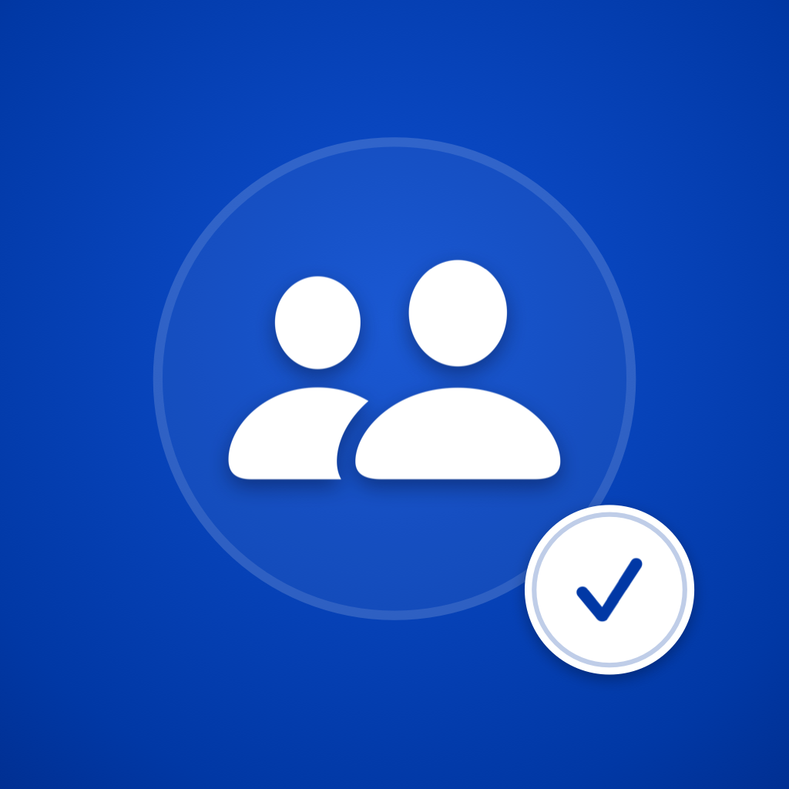
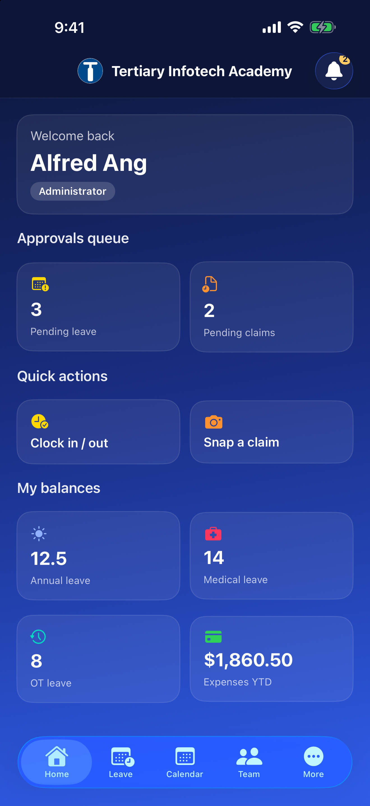
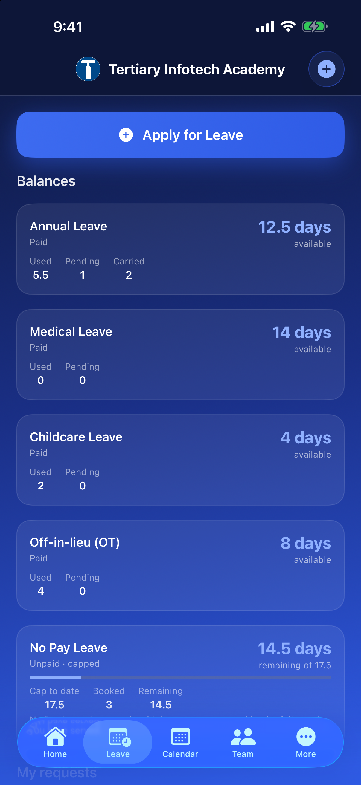
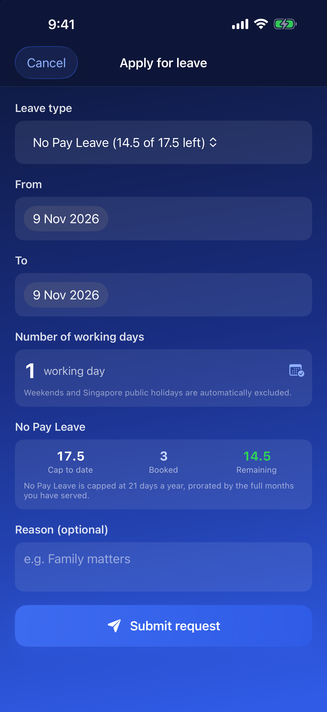
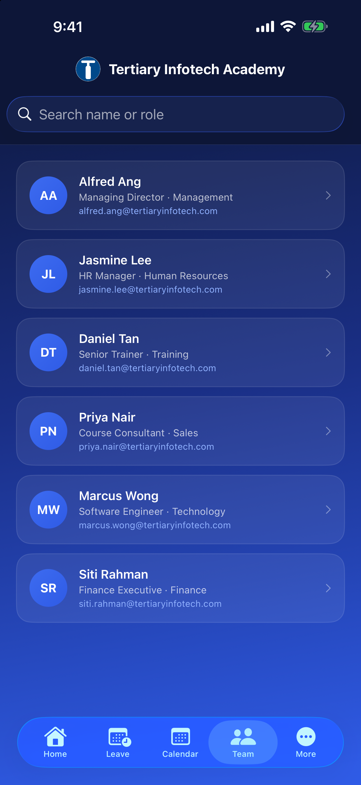
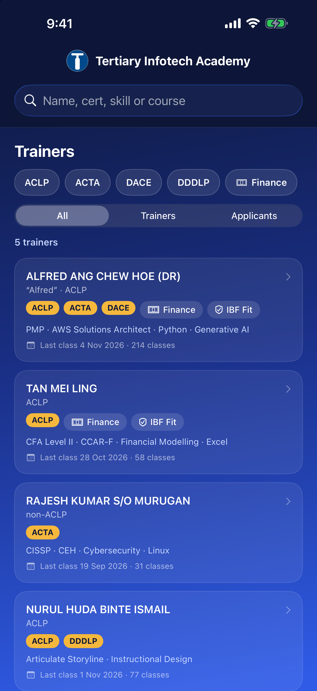
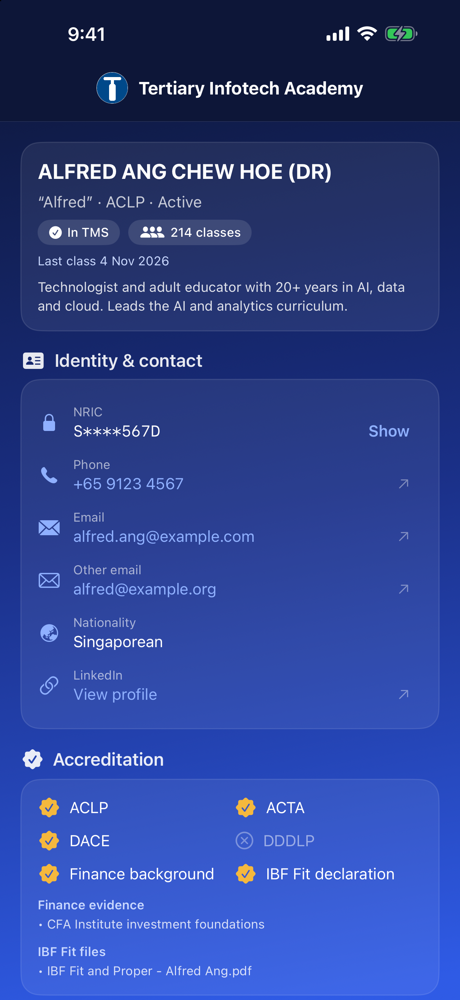
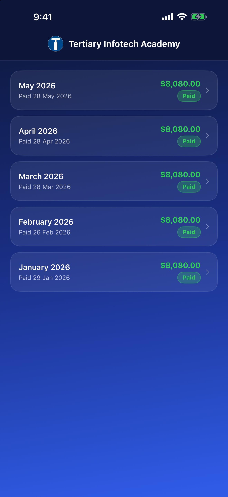
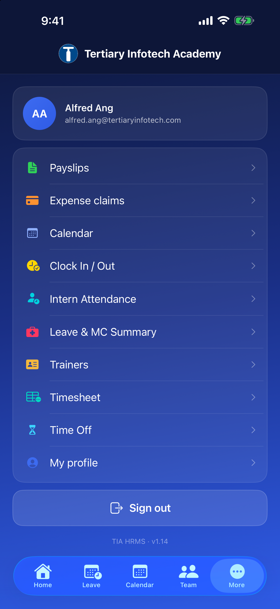

<div align="center">



# TIA HRMS — iOS

**Native SwiftUI client for the Tertiary Infotech Academy HR Management System.**

A fully native iPhone app (no Capacitor, no WebView) that signs employees in and pulls their HR
data live from the company's HRMS backend on Coolify.

<a href="https://apps.apple.com/sg/app/tertiary-hrms/id6759821144">
  
</a>


-0A1F44?logo=appstore)


</div>

## Screenshots



| Dashboard | Leave balances (No Pay Leave) | Apply as No Pay Leave | Team |
|---|---|---|---|
|  |  |  |  |

| Trainers (Trainer Admin) | Trainer profile | Payslips | More |
|---|---|---|---|
|  |  |  |  |

## What it is

This is the App Store build of the Tertiary HRMS, rebuilt **natively in SwiftUI**. It is a thin,
secure client over the existing HRMS web backend — it holds no database of its own and enforces no
business rules locally; the server remains the single source of truth.

- **Backend:** the HRMS **Next.js 14** app deployed on **Coolify** at
  `https://hrms.tertiaryinfotech.com`, backed by PostgreSQL on the same Coolify host.
- **The iOS app pulls all data from that Coolify deployment over HTTPS** through the web app's
  authenticated API — it never touches the database directly.
- **Auth** reuses the web app's **NextAuth (Auth.js)** session: a standard
  `csrf → callback → session` flow, with the session cookie persisted so employees stay signed in.
  **Email + password**, **email one-time-code (OTP)** and **Google sign-in** are supported —
  the last via Apple's `ASWebAuthenticationSession` with an OAuth 2.0 PKCE flow (no third-party
  SDK), whose Google `id_token` the backend verifies before issuing the session.
- A small, **additive `/api/mobile/*`** namespace was added to the web backend to expose (as JSON)
  the same data the web pages render, plus the app's writes (receipt-photo claims, clock in/out).
  It changes no existing web behaviour; approver-only data (approvals, intern attendance, a
  colleague's records) is enforced server-side.

## Features

**Included** — the employee HR experience:

| Module | What you get |
|---|---|
| 🔐 **Login** | Premier-Blue email + password, email-OTP, and **Continue with Google**; session persists across launches |
| 🏠 **Dashboard** | Annual / medical / OT leave balances, expenses YTD, and (for ADMIN/HR/MANAGER) the pending-approvals queue |
| 🗓️ **Leave** | Balances (including the **No Pay Leave** cap and days left), full request history, and **apply for leave** — with a **live working-days preview** (weekends & SG public holidays auto-excluded) and MC-photo attach for medical leave. Annual leave beyond the balance offers **Apply as No Pay Leave instead**; interns' MC goes in as No Pay Leave with the certificate attached |
| 👥 **Team** | Company directory (richer contact details for supervisory roles). Approvers tap a person for their **clock-in history** (every clock in/out, grouped by month), **MC history** and **leave history** — tapping the Days clocked / MC days / Leave days tiles opens each full history |
| 🧾 **Payslips** | Personal payslips with a native **PDFKit** viewer for the authenticated PDF |
| 💳 **Expenses** | Personal expense claims with status and approved totals, plus **submit a claim with a receipt photo** (camera or library) |
| 📅 **Calendar** | Planner-app layout: Month / List, Monday-first grid with adjacent-month days greyed, chips + "+N", today circled, every SG public holiday on a grey cell with its name, the selected day's agenda below; *Everyone / Only me*; refresh button + "Synced h:mm". Colleagues' leave *type* stays private unless you're an approver |
| 📆 **iPhone Calendar sync** | One-way EventKit sync (like the Planner app) of your approved leave, MC and time off — optionally public holidays and, for admins, team leave — into the iPhone calendars you tick; runs at launch, on return, after applying/approving, on calendar changes and every 2 min; only touches events carrying its `HRMS id:` marker |
| ⏱️ **Clock In / Out** | One-tap **clock in / out** with a live elapsed timer and a monthly daily check-in/out history with total hours — an open punch shows **hours so far** today, or **"No clock-out"** for an earlier day |
| 🗂️ **Timesheet** (interns only) | Interns: their own days and hours per month. Approvers: one Timesheet screen — missing-punch and Off In Lieu approvals plus every intern's days worked + total hours per month, drilling into their daily history. Staff log weekend / PH work under **Off In Lieu** |
| 📇 **Trainers** (everyone, More → Staff) | Trainer contact list for every staff member and intern: search, then email / call / WhatsApp — `GET /api/mobile/trainers/contacts` (no NRIC) |
| 🎓 **Trainer Management** (Trainer Admin, More → Manage) | Search with skill / certification suggestions (with counts) that become removable filter tokens; one Filters menu for ACLP / ACTA / DACE / DDDLP / Finance / IBF Fit and Trainers / Applicants; compact rows with the matching skill first and call / WhatsApp / email / copy; profiles with masked NRIC and collapsible sections — `GET /api/mobile/trainers` |
| 🩺 **Leave & MC Summary** (admin) | Every staff member's and intern's MC and leave for the month (approved vs pending, intern time-off hours), drilling into each person's requests and AL / MC balances — `GET /api/mobile/leave-summary` |
| 🔔 **Notifications** | In-app bell with unread badge listing every alert, plus **push notifications** (APNs): interns get missed clock-in/out and timesheet reminders, admins get every new leave / MC / NPL, time-off and expense request; tapping opens the right screen (Approvals for admins) |
| ☰ **More menu** | Applications (MC, Leave, Time Off, Expense Claims, Off In Lieu) · Staff (Calendar, Payslips, My Profile, Trainers) · Intern (Time In/Out) · Manage · Help |
| 🙋 **Profile** | Your full employee record, with **self-service edit** and **change password** |

**Excluded** — by product decision:

- The **Accounting module** in full (bank-statement import, dedupe, reconciliation, income/expense
  tracking) — back-office finance, not part of the mobile employee experience.
- Heavy **admin authoring** flows (creating employees, generating payroll, company settings, email
  templates) — these remain on the web; the dashboard surfaces approval counts only.

## Tech

- **Swift 5 / SwiftUI**, MVVM, single coordinator (`AuthViewModel`).
- Networking: two `actor`s — `AuthService` (NextAuth sign-in) and `HRMSAPI` (typed reads and
  writes — apply-leave, claims, clock, approvals, profile — plus PDF download) over a shared cookie store.
- **System frameworks only** — SwiftUI, Foundation/URLSession, PDFKit. No third-party dependencies.
- **XcodeGen** project generation (`project.yml`); the `.xcodeproj` is gitignored.
- iOS 16+, iPhone, portrait. Theme: **one light TIA premium-blue theme** (white cards on a pale blue surface, navy #0D1638 text, royal #2F5BE6 actions, gold #F5B83D only as a sparing accent). No dark mode (`.preferredColorScheme(.light)`), matching the web app.

## Build

```bash
brew install xcodegen        # one-time
xcodegen generate

# Compile-check in the Simulator (no signing required)
xcodebuild build -project TertiaryHRMSiOSApp.xcodeproj -scheme TertiaryHRMSiOSApp \
  -destination 'platform=iOS Simulator,name=iPhone 17 Pro' \
  -derivedDataPath /tmp/hrms_dd CODE_SIGNING_ALLOWED=NO

# Unit tests (leave-rule errors + trainer decoding)
xcodebuild test -project TertiaryHRMSiOSApp.xcodeproj -scheme TertiaryHRMSiOSApp \
  -destination 'platform=iOS Simulator,name=iPhone 17 Pro Max' CODE_SIGNING_ALLOWED=NO

# Run on a connected iPhone
xcodebuild build -project TertiaryHRMSiOSApp.xcodeproj -scheme TertiaryHRMSiOSApp \
  -destination 'platform=iOS,name=<your iPhone>' -allowProvisioningUpdates
```

## Project layout

```
TertiaryHRMSiOSApp/
├─ project.yml                 # XcodeGen config (bundle com.tertiaryinfotech.hrportal)
├─ TertiaryHRMSiOSApp/
│  ├─ App/                     # @main entry
│  ├─ Theme/                   # TIA premium-blue palette + formatters
│  ├─ Models/                  # Codable models for the mobile API
│  ├─ Resources/               # Asset catalog (app icon, colours)
│  ├─ Services/                # AuthService (NextAuth), GoogleSignInService (OAuth+PKCE), HRMSAPI
│  ├─ ViewModels/              # AuthViewModel
│  ├─ Views/                   # Login + tabbed feature screens
│  └─ Support/                 # Info.plist, PrivacyInfo.xcprivacy
├─ scripts/                    # Premier Blue icon + screenshot framer
└─ .claude/skills/             # app-store-submission, ios-auto-release, mobile-ios-design, ipados-design-guidelines
```

## App Store

Bundle id `com.tertiaryinfotech.hrportal` → the existing **Tertiary HRMS** App Store record
(ASC app `6759821144`). **Status: v1.14 (build 21) live in the Singapore App Store; v1.15 (build 28 — push notifications, iPhone Calendar sync, Planner-style calendar with all public holidays, More menu in Applications / Staff / Intern sections, trainer contacts for all staff, new premium-blue icon) submitted 2026-11-11, waiting for review:
[apps.apple.com/sg/app/tertiary-hrms/id6759821144](https://apps.apple.com/sg/app/tertiary-hrms/id6759821144).** Submission is automated via the bundled `app-store-submission` skill and
its bundled `asc_submit.py` (App Store Connect API); `ios-auto-release` wires up CI/CD for
future builds. Credentials live in a gitignored `.env`; the `.p8` key never enters the repo.

---

<div align="center">
Built for <b>Tertiary Infotech Academy Pte Ltd</b>.
</div>
